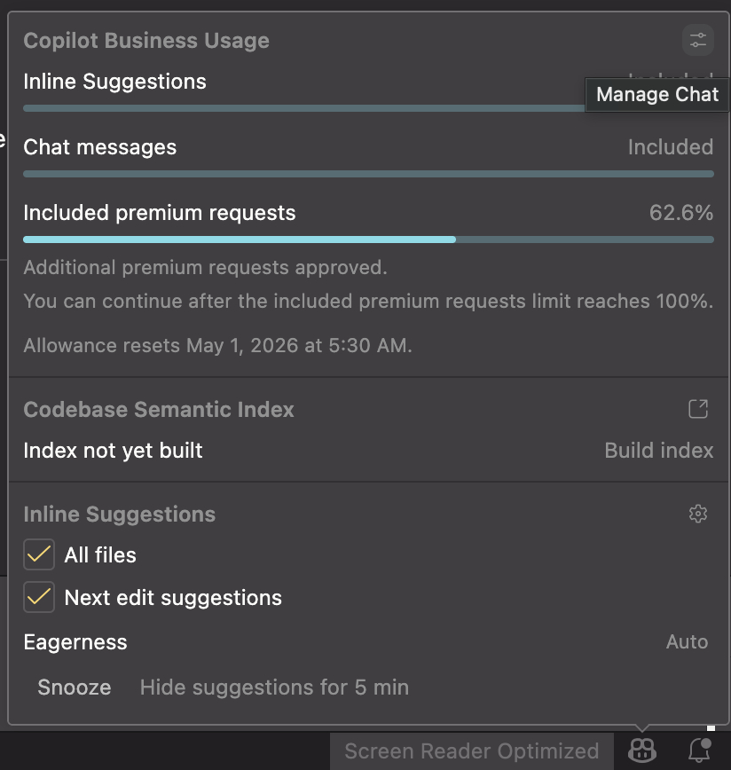
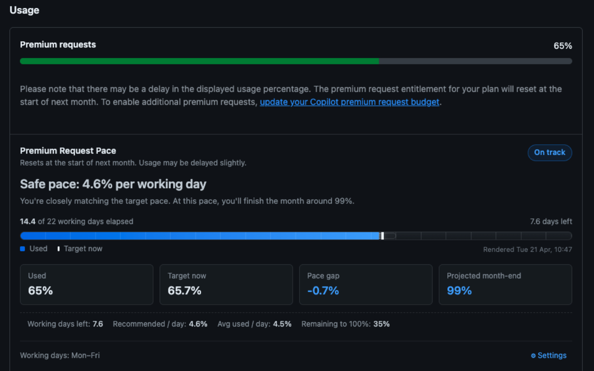
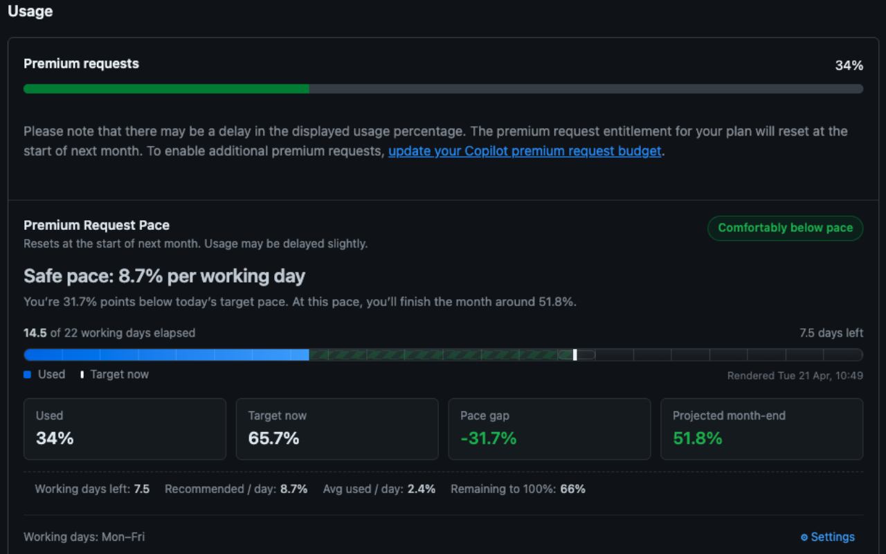
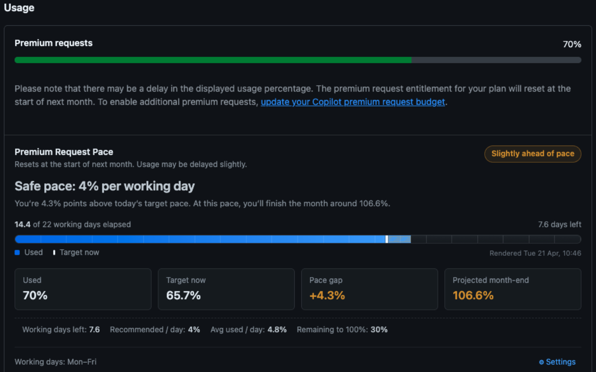
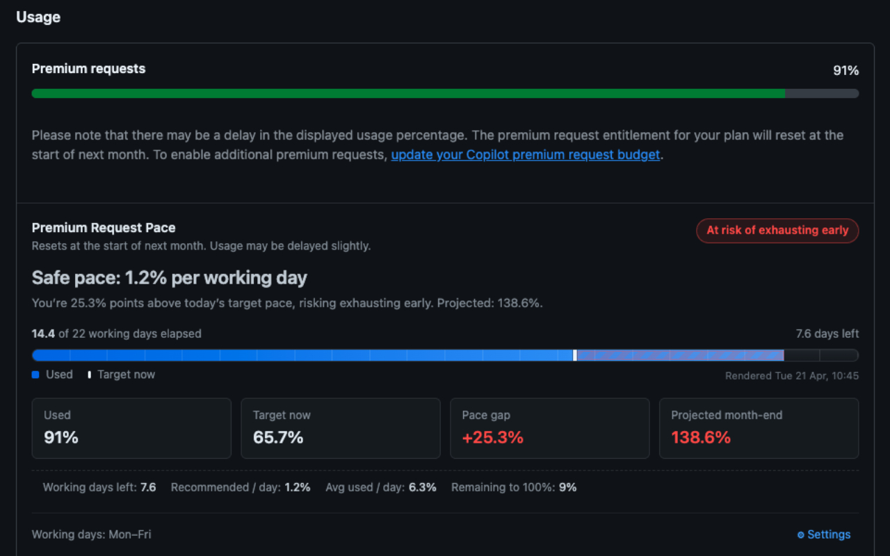

  

<h1 align="center">GitHub Copilot Premium Request Pace</h1>

  A lightweight Chrome extension that adds a pacing dashboard to GitHub Copilot settings so you can see whether your premium request usage is on track for the month.

  <a href="https://chromewebstore.google.com/detail/github-copilot-premium-re/lhdeckikookemaidcbcflflgbbhggmka?authuser=0&hl=en-GB">Install from Chrome Web Store</a>
  ·
  <a href="https://github.com/settings/copilot/features">Open Copilot Page</a>
  ·
  <a href="#features">Features</a>
  ·
  <a href="#privacy--permissions">Privacy</a>
  ·
  <a href="#local-development">Local development</a>

  
  
  

> GitHub shows your current premium usage. This extension adds the missing context: where you should be today, whether you are ahead or behind pace, and where your current trend is likely to land by month end.

## Why Use It

If you rely on GitHub Copilot premium requests across a full month, a raw usage percentage is not enough. You need to know whether that number is healthy for today.

This extension injects a small dashboard into the GitHub Copilot settings page and calculates:

- your target usage pace for the current day
- whether you are below pace, on track, or trending too hot
- your projected month-end usage if current behavior continues
- remaining working days based on your own weekly schedule

Everything runs locally in the browser. No API keys, no external services, and no telemetry.

## Quick Access

You can open the GitHub page used by this extension in two fast ways:

1. Open it directly in your browser: <https://github.com/settings/copilot/features>
2. Open it from VS Code by clicking the top-right Manage Chat icon inside the Copilot usage panel, which opens the same GitHub Copilot settings page

  

  <em>VS Code shortcut: click Manage Chat to jump straight to the GitHub Copilot settings page.</em>

## Features

- Inline dashboard on GitHub's Copilot settings page
- Pace gap calculation against the current point in the month
- Projected month-end usage based on your current trend
- Working-day aware pacing, with Mon-Fri as the default schedule
- Configurable working days in both the injected card and popup
- GitHub-style UI that blends into the existing settings page
- Automatic refresh when the page updates

## What The Dashboard Shows

| Metric | What it helps you answer |
| --- | --- |
| Current usage | How much of your premium quota GitHub currently reports as used |
| Target pace | Where your usage should be today if you want to spread usage across the month |
| Pace gap | Whether you are ahead of schedule or comfortably under it |
| Projection | Where you may finish by month end if your current pattern continues |
| Working days remaining | How many active days are left in your personal schedule |

## Pace States

The dashboard surfaces your status with clear visual states so you can understand your position without doing any mental math.

| State | Meaning |
| --- | --- |
| On track | Your current usage is close to the expected pace for today |
| Below pace | You are spending more slowly than planned and have buffer |
| Slightly above pace | You are running a bit hotter than planned and may want to slow down |
| At risk | Your current trend suggests you may exhaust your premium requests too early |

## Screenshots

These examples show how the pace card looks across the main usage states.

<table>
  <tr>
    <td align="center">
      
       
      <strong>On track</strong>
    </td>
    <td align="center">
      
       
      <strong>Comfortably below pace</strong>
    </td>
  </tr>
  <tr>
    <td align="center">
      
       
      <strong>Slightly above pace</strong>
    </td>
    <td align="center">
      
       
      <strong>At risk of exhausting early</strong>
    </td>
  </tr>
</table>

## How It Works

The extension runs only on the GitHub Copilot settings page:

- `https://github.com/settings/copilot/features`

It reads the usage percentage already visible on that page, then performs local calculations to estimate pace, gap, and projection. It does not call GitHub APIs and it does not send data anywhere.

## Installation

### Chrome Web Store

Install the published extension here:

- <https://chromewebstore.google.com/detail/github-copilot-premium-re/lhdeckikookemaidcbcflflgbbhggmka?authuser=0&hl=en-GB>

### After Installing

1. Open GitHub Copilot settings at `github.com/settings/copilot/features`, either directly in the browser or from the VS Code Manage Chat shortcut shown above.
2. Look for the pace card injected below the premium usage section.
3. Optionally open the extension popup or inline settings to choose which weekdays count as working days.

## Configuration

The extension currently supports one main preference:

- Working days: choose which weekdays should count toward your monthly pace plan

By default, Monday through Friday are enabled.

Your selection is stored with Chrome's storage API so it persists across sessions and can sync across browsers if Chrome sync is enabled.

## Privacy & Permissions

### Privacy

- No personal data is collected
- No usage data is transmitted
- No analytics or telemetry are included
- No external servers or third-party APIs are used

### Permissions

- `storage`
  Used only to save your working-day preference.
- Host access for `https://github.com/settings/copilot/features*`
  Used only to inject the dashboard into that GitHub settings page and read the usage percentage already displayed there.

## Limitations

- The extension depends on the usage percentage GitHub displays on the page
- Projections are based on your current trend and assume roughly linear usage
- Working-day settings affect only your personal pace calculation, not GitHub's actual quota logic
- If GitHub significantly changes the page structure, the injected UI may need an update

## Local Development

1. Clone this repository.
2. Open `chrome://extensions` in Chrome.
3. Enable Developer mode.
4. Click Load unpacked.
5. Select this project folder.
6. Open `https://github.com/settings/copilot/features` to test the injected card.

## Contributing

Issues and pull requests are welcome.

Good contributions include:

- improving resilience when GitHub changes its settings page
- refining pacing logic or copy clarity
- improving the injected UI and popup UX
- adding a screenshot gallery and documentation polish

## License

This project is licensed under the MIT License. See the `LICENSE` file for details.